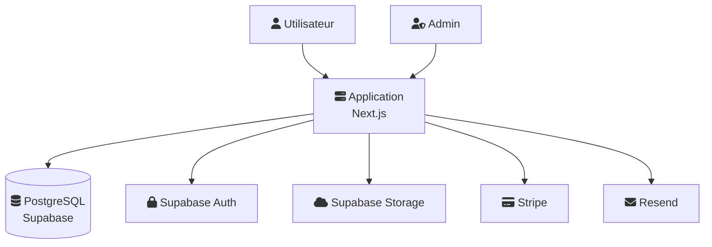
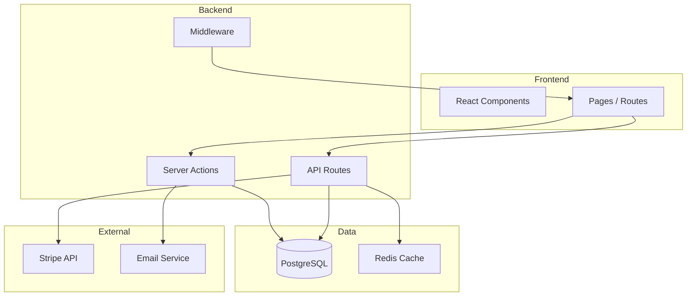
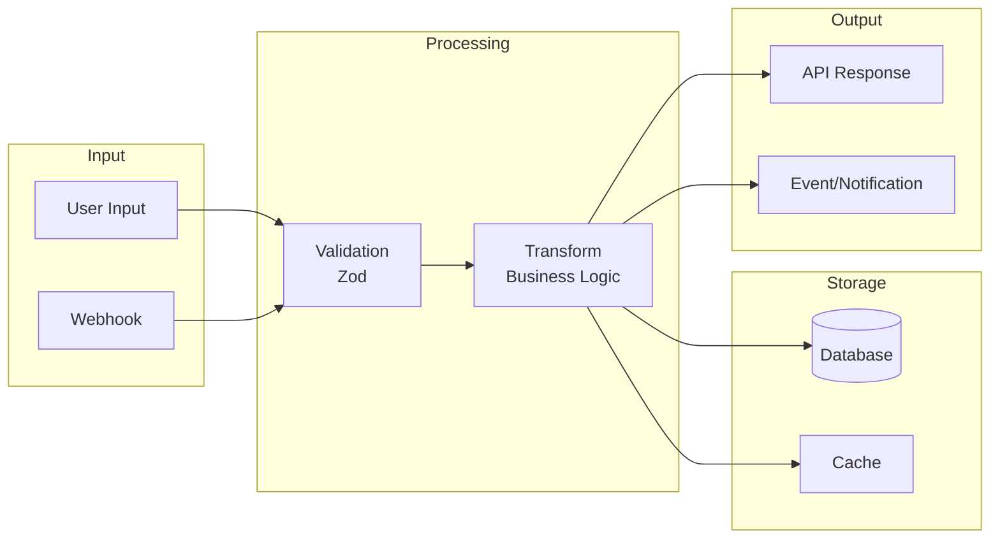
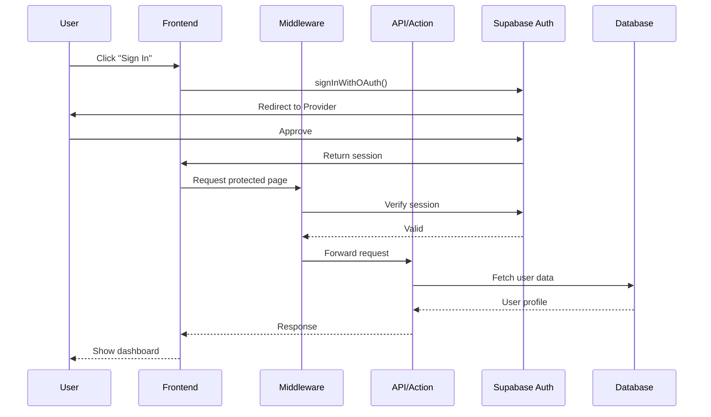
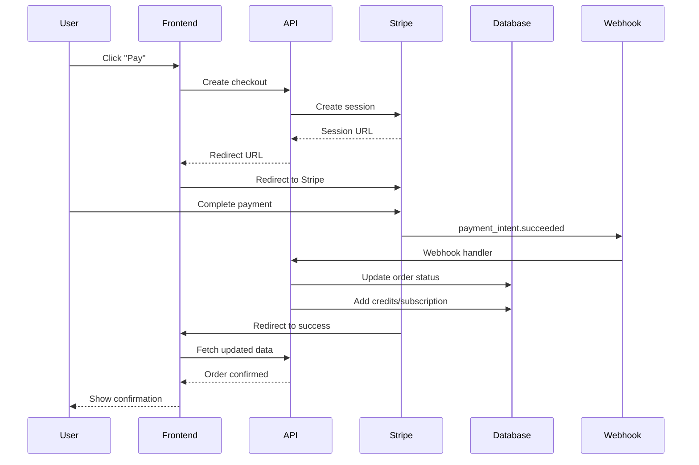
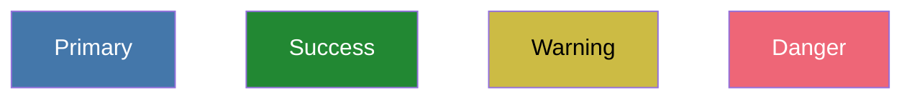
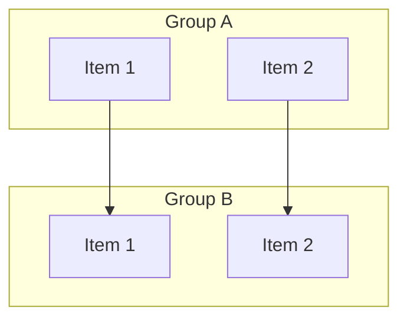
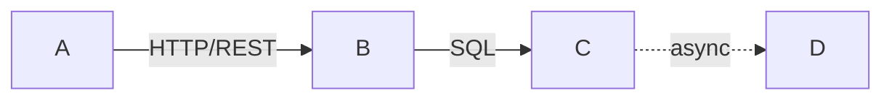

# Templates pour System Design

## Diagrammes Mermaid

### System Context (C4 Level 1)



### Containers (C4 Level 2)



### Data Flow



### Sequence Diagram (Auth Flow)



### Sequence Diagram (Payment Flow)



## README arc42-lite Template

```markdown
# System Design

Vue d'ensemble de l'architecture du projet.

## 1. Introduction et Objectifs

### Objectifs business
- [Objectif 1]
- [Objectif 2]

### Objectifs qualite
| Objectif | Metrique |
|----------|----------|
| Performance | P95 < 200ms |
| Disponibilite | 99.9% uptime |
| Securite | OWASP Top 10 |

## 2. Contraintes

### Techniques
- Next.js 15 (App Router)
- PostgreSQL via Supabase
- Vercel pour l'hebergement

### Organisationnelles
- Equipe : [taille]
- Timeline : [dates]

## 3. Contexte

Voir [system-context.md](diagrams/system-context.md)

### Acteurs
| Acteur | Description |
|--------|-------------|
| Utilisateur | ... |
| Admin | ... |

### Systemes externes
| Systeme | Usage |
|---------|-------|
| Supabase | Auth, DB, Storage |
| Stripe | Paiements |

## 4. Strategie de Solution

### Decisions architecturales cles
- Monolithe Next.js (simplicite)
- Server Components par defaut (performance)
- Server Actions pour mutations (DX)

Voir [decisions/](../memory-bank/decisions/) pour les ADRs.

## 5. Vue Containers

Voir [containers.md](diagrams/containers.md)

## 6. Flux de Donnees

Voir [data-flow.md](diagrams/data-flow.md)

### Flows critiques
- [Auth Flow](flows/auth-flow.md)
- [Payment Flow](flows/payment-flow.md)

## 7. Risques et Dette Technique

| Risque | Impact | Mitigation |
|--------|--------|------------|
| [Risque 1] | [Impact] | [Mitigation] |

### Dette technique connue
- [ ] [Dette 1]
- [ ] [Dette 2]

---

*Genere avec `/map-system` - Mettre a jour manuellement si l'architecture evolue*
```

## Bonnes pratiques Mermaid

### Couleurs (optionnel)



### Subgraphs pour grouper



### Liens avec labels



### Formes

| Syntaxe | Forme |
|---------|-------|
| `[text]` | Rectangle |
| `(text)` | Rectangle arrondi |
| `{text}` | Losange (decision) |
| `[(text)]` | Cylindre (database) |
| `((text))` | Cercle |
